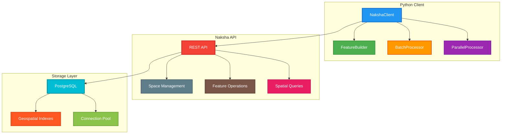
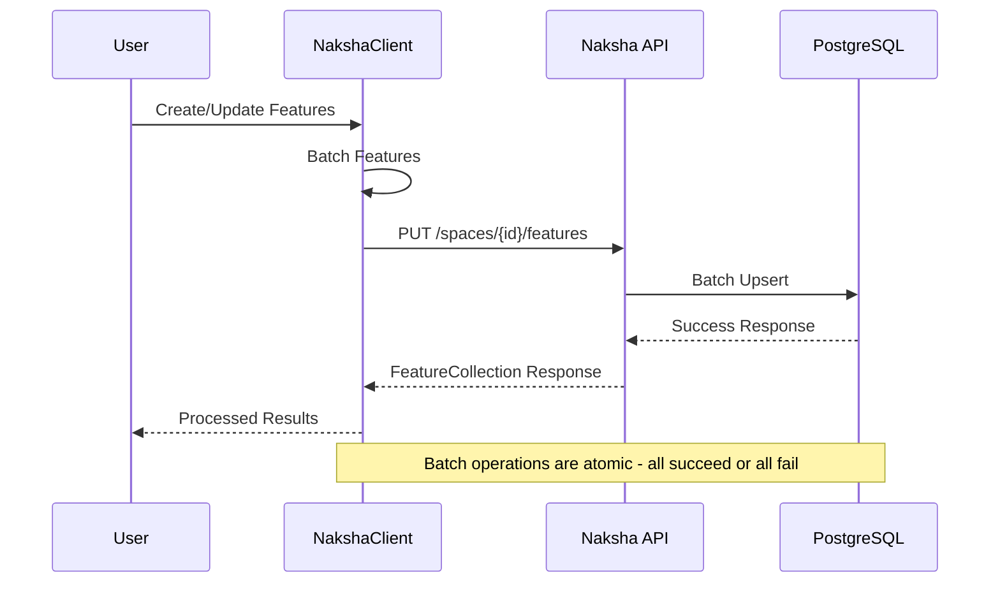
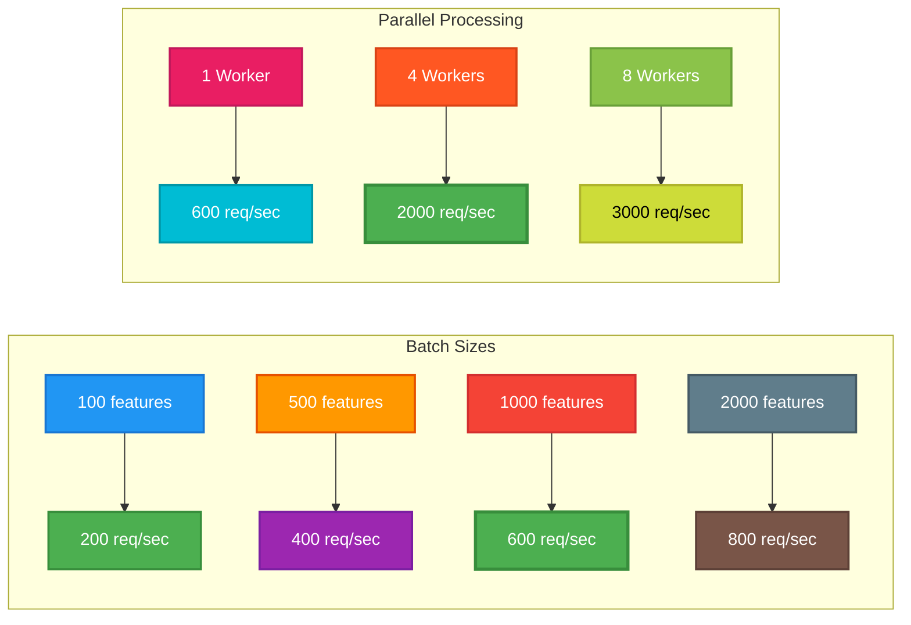
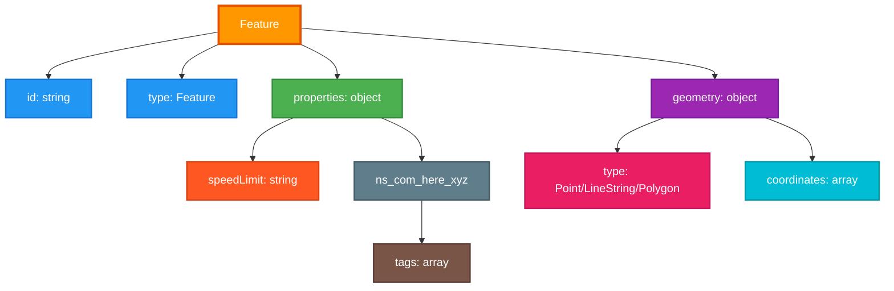
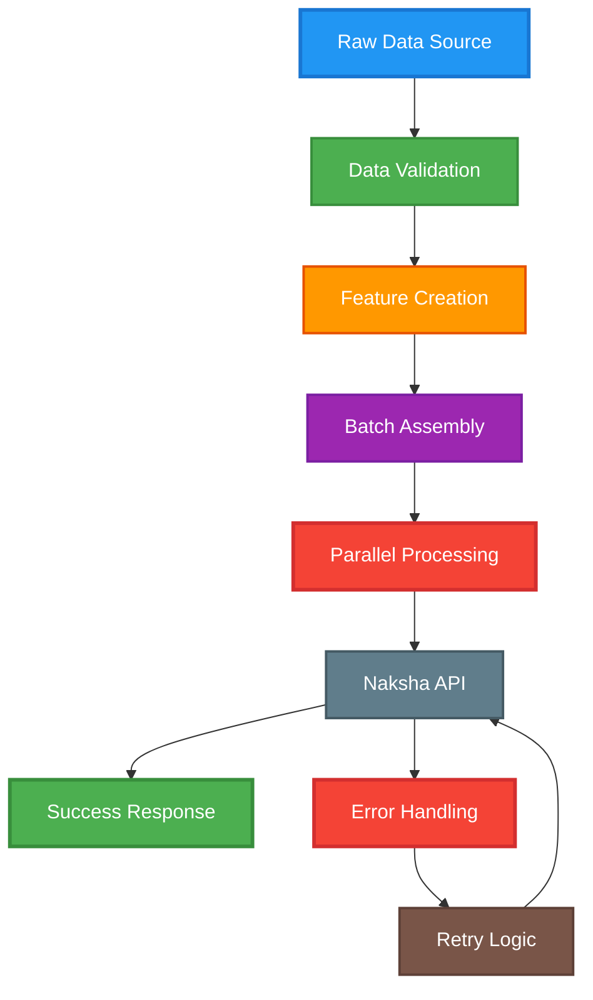
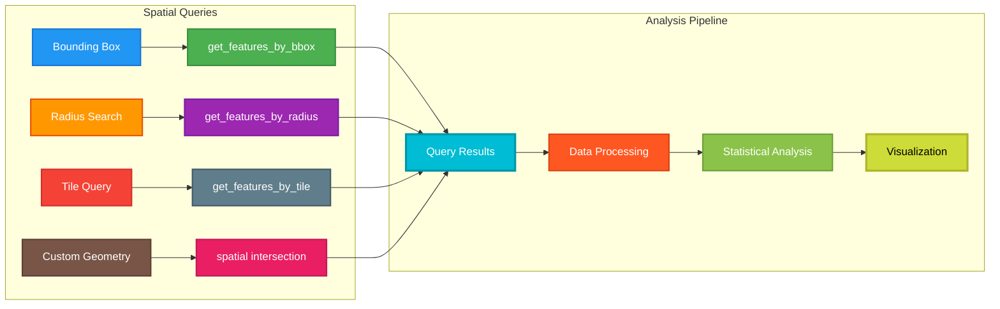
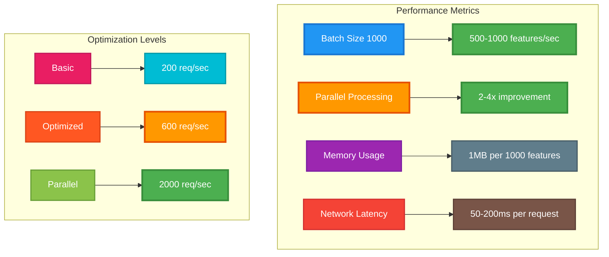

# Naksha Python Client Example

This repository contains a comprehensive Python client for connecting to Naksha, HERE's geospatial data platform.

## Architecture Overview



## Data Flow



## Features

- **Batch Operations**: Efficient bulk create, update, and delete operations
- **Spatial Queries**: Bounding box, radius, and tile-based queries
- **Parallel Processing**: High-performance data loading with concurrent requests
- **Error Handling**: Robust retry logic with exponential backoff
- **Feature Building**: Helper classes for creating GeoJSON features
- **Performance Optimization**: Configurable batch sizes and connection pooling

## Installation

```bash
pip install -r requirements.txt
```

## Quick Start

```python
from naksha_python_example import NakshaClient, NakshaConfig, FeatureBuilder

# Configure your connection
config = NakshaConfig(
    base_url="https://naksha-v2-dev.ext.mapcreator.here.com",
    access_token="your_access_token_here"
)

# Create client
client = NakshaClient(config)

# Create a space
space_response = client.create_space(
    space_id="my-space",
    title="My Test Space",
    description="A space for testing"
)

# Create features
features = []
for i in range(100):
    feature = FeatureBuilder.create_point_feature(
        coordinates=(8.68872 + i * 0.001, 50.0561 + i * 0.001, 100.0),
        properties={"speedLimit": str(30 + i % 5 * 10)},
        feature_id=f"feature-{i}"
    )
    features.append(feature)

# Batch upsert features
responses = client.batch_upsert_features("my-space", features)
print(f"Successfully processed {len(features)} features")
```

## API Methods

### Space Management

- `create_space(space_id, title, description)`: Create a new space
- `get_spaces()`: List all accessible spaces
- `delete_space(space_id)`: Delete a space

### Feature Operations

#### Batch Operations
- `batch_upsert_features(space_id, features, batch_size)`: Create or update features in batches
- `batch_create_features(space_id, features, batch_size)`: Create features (POST method)
- `parallel_batch_upsert(space_id, features, max_workers)`: Parallel batch processing

#### Query Operations
- `get_features_by_ids(space_id, feature_ids)`: Get features by ID
- `get_features_by_bbox(space_id, west, south, east, north, limit)`: Spatial query by bounding box
- `get_features_by_radius(space_id, lat, lon, radius, limit)`: Spatial query by radius
- `search_features(space_id, tags, properties_query, limit)`: Search by tags and properties
- `iterate_all_features(space_id, batch_size)`: Iterate through all features

#### Delete Operations
- `delete_features(space_id, feature_ids)`: Delete features by ID

## Performance Best Practices

### Performance Comparison



### 1. Batch Size Optimization

```python
# Test different batch sizes for your use case
config = NakshaConfig(
    base_url="your_url",
    access_token="your_token",
    batch_size=1000  # Adjust based on your data size
)
```

### 2. Parallel Processing

```python
# For large datasets, use parallel processing
responses = client.parallel_batch_upsert(
    space_id="my-space",
    features=large_feature_list,
    max_workers=4  # Adjust based on your system
)
```

### 3. Connection Pooling

The client automatically uses connection pooling via `requests.Session()` for better performance.

## Data Formats

### Feature Structure



```python
feature = {
    "id": "unique-feature-id",
    "type": "Feature",
    "properties": {
        "speedLimit": "60",
        "@ns:com:here:xyz": {
            "tags": ["traffic", "sign"]
        }
    },
    "geometry": {
        "type": "Point",
        "coordinates": [8.68872, 50.0561, 100.0]
    }
}
```

### Supported Geometry Types

- **Point**: Single coordinate `[lon, lat, elevation]`
- **LineString**: Array of coordinates `[[lon1, lat1], [lon2, lat2], ...]`
- **Polygon**: Array of coordinate rings `[[[lon1, lat1], [lon2, lat2], ...]]`

## Error Handling

The client includes robust error handling:

- **Automatic Retries**: Configurable retry logic with exponential backoff
- **Request Timeouts**: Configurable timeout settings
- **Detailed Logging**: Comprehensive logging for debugging

```python
config = NakshaConfig(
    base_url="your_url",
    access_token="your_token",
    timeout=30,        # Request timeout in seconds
    max_retries=3      # Number of retry attempts
)
```

## Examples

### Data Processing Workflow



### 1. Bulk Data Import

```python
# Import large dataset efficiently
def import_large_dataset(client, space_id, data_source):
    features = []
    for row in data_source:
        feature = FeatureBuilder.create_point_feature(
            coordinates=(row['lon'], row['lat'], row['elevation']),
            properties={
                "name": row['name'],
                "type": row['type']
            }
        )
        features.append(feature)
    
    # Use parallel processing for large datasets
    responses = client.parallel_batch_upsert(space_id, features, max_workers=4)
    return responses
```

### 2. Spatial Analysis



```python
# Find all features within a specific area
def analyze_area(client, space_id, bbox):
    features = client.get_features_by_bbox(
        space_id,
        west=bbox['west'],
        south=bbox['south'],
        east=bbox['east'],
        north=bbox['north']
    )
    
    # Analyze the features
    df = pd.DataFrame([f['properties'] for f in features])
    return df.describe()
```

### 3. Real-time Updates

```python
# Update features in real-time
def update_features(client, space_id, updates):
    features = []
    for update in updates:
        feature = FeatureBuilder.create_point_feature(
            coordinates=update['coordinates'],
            properties=update['properties'],
            feature_id=update['id']
        )
        features.append(feature)
    
    # Use upsert to create or update
    responses = client.batch_upsert_features(space_id, features)
    return responses
```

## Configuration

### Environment Variables

```bash
export NAKSHA_BASE_URL="https://naksha-v2-dev.ext.mapcreator.here.com"
export NAKSHA_ACCESS_TOKEN="your_access_token"
```

### Configuration Class

```python
config = NakshaConfig(
    base_url=os.getenv("NAKSHA_BASE_URL"),
    access_token=os.getenv("NAKSHA_ACCESS_TOKEN"),
    timeout=30,
    max_retries=3,
    batch_size=1000
)
```

## Troubleshooting

### Common Issues

1. **Authentication Errors**: Verify your access token is valid
2. **Timeout Errors**: Increase timeout or reduce batch size
3. **Memory Issues**: Reduce batch size for large datasets
4. **Rate Limiting**: Implement delays between requests

### Debug Mode

```python
import logging
logging.basicConfig(level=logging.DEBUG)
```

## Performance Benchmarks



Typical performance metrics:

- **Batch Size 1000**: ~500-1000 features/second
- **Parallel Processing**: 2-4x improvement with 4 workers
- **Memory Usage**: ~1MB per 1000 features
- **Network Latency**: 50-200ms per request

## Contributing

1. Fork the repository
2. Create a feature branch
3. Add tests for new functionality
4. Submit a pull request

## License

This example is provided as-is for educational purposes. 